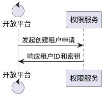

# starter-auth

权限服务

## 目录结构

- bc --限界上下文
    - adapter --适配器（表现层）
        - consumer --消息队列监听
        - scheduler --定时任务调度
        - controller --http请求监听
        - grpc --grpc请求监听
    - app --应用层（主要实现）
    - domain --领域层
        - biserrs --业务异常定义
        - gateway --下游适配器网关（防腐层接口）
        - model --领域模型
    - infr --基础设施层
        - bcconsts --常量集合
        - gatewayimpl --下游网关实现（防腐层实现）
            - convs --跨域对象转换器
        - repo --仓储层
            - po --仓储层对象
- configs --本地配置
- docs --swagger文件
- main.go --启动程序
- zz_generated.ioc.go --ioc文件

## 接口文档

[http://127.0.0.1:8900/swagger/index.html](http://127.0.0.1:8900/swagger/index.html)

## 核心业务流程时序图

### 创建租户

### 授权码登录

## 监听消息队列(Topic)

NSQ:TenantInit

## 配置中心需要预制的配置项(yaml)

- /clover-auth/default
- /clover-auth/v0.0.1
